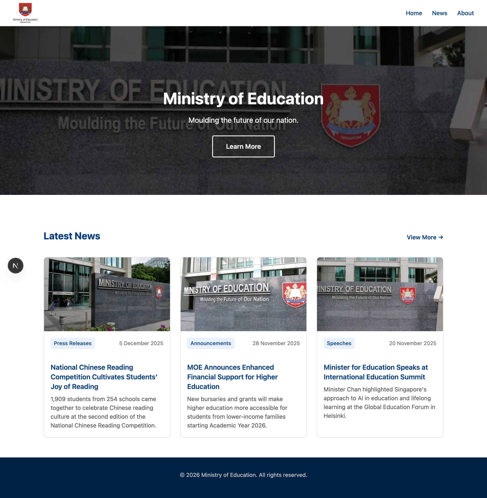

# MOE Website (Prototype)

A prototype website for the Ministry of Education, built with Next.js 15 and Directus CMS.

## Tech Stack

- **Next.js 15** (App Router)
- **React 19** + TypeScript
- **react-markdown** (rich content rendering)
- **Directus**
- **Vitest** + Testing Library (unit & component tests)

## Getting Started

### Using Mock Data (default)

```bash
npm install
npm run dev       # http://localhost:3000
npm run build     # Production build
npm test          # Run tests
```

### Using Directus CMS

1. Start Directus via Docker:

```bash
docker compose up -d
```

2. Open Directus admin at http://localhost:8055 and log in with:
   - **Email:** `admin@moe.gov.sg`
   - **Password:** `admin123`

3. **Create 4 collections manually via the UI:**

   **hero** (toggle Singleton)
   | Field | Type |
   | ------ | ---- |
   | `title` | Input |
   | `subtitle` | Input |
   | `ctaText` | Input |
   | `ctaLink` | Input |
   | `backgroundImage` | Input |

   **categories**
   | Field | Type |
   | ------ | ---- |
   | `name` | Input |
   | `slug` | Input |

   **news**
   | Field | Type |
   | ------ | ---- |
   | `title` | Input |
   | `slug` | Input |
   | `excerpt` | Textarea |
   | `body` | WYSIWYG |
   | `publishDate` | Date |
   | `category` | Many-to-One → **categories** |
   | `image` | Input |
   | `alt` | Input |

   **pages**
   | Field | Type |
   | ------ | ---- |
   | `title` | Input |
   | `slug` | Input |
   | `body` | WYSIWYG |

4. **Generate an admin access token:**
   - Click your **avatar icon** in the bottom-left corner of the sidebar
   - Create and copy the access token

5. Create `.env.local` in the project root:

```
DATA_SOURCE=directus
DIRECTUS_URL=http://localhost:8055
DIRECTUS_TOKEN=<your-admin-token>
```

| Variable | Default | Description |
|---|---|---|
| `DATA_SOURCE` | `mock` | `"mock"` for local JSON, `"directus"` for Directus CMS |
| `DIRECTUS_URL` | `http://localhost:8055` | Directus instance URL |
| `DIRECTUS_TOKEN` | — | Static access token for Directus API |

See `.env.example` for a template.

6. **Seed the data** (clears and repopulates all collections):

   ```bash
   npx tsx scripts/seed.ts
   ```

   You should see:
   ```
   Clearing existing data...
   Seeding categories...
   Seeding news articles...
   Seeding pages...
   Seeding hero...
   Seed complete!
   ```

7. Run the app:

   ```bash
   npm run dev
   ```

To switch back to mock data, set `DATA_SOURCE=mock` in `.env.local`.

## Project Structure

```
src/
├── app/          # Pages (Server Components)
├── components/   # Reusable UI components
├── data/         # Mock JSON data files (used when DATA_SOURCE=mock)
├── lib/          # API layer, types, Directus client
├── scripts/      # Utility scripts (seed.ts)
└── test/         # Test setup & factories
```

## Architecture

See [architecture.md](./architecture.md) for detailed architecture notes, including data fetching strategy, schema design, trade-offs, and scaling considerations.

## Directus Screenshots


## Desktop Screenshots



.png>)

.png>)

## Mobile Screenshots

.png>)

.png>)

.png>)